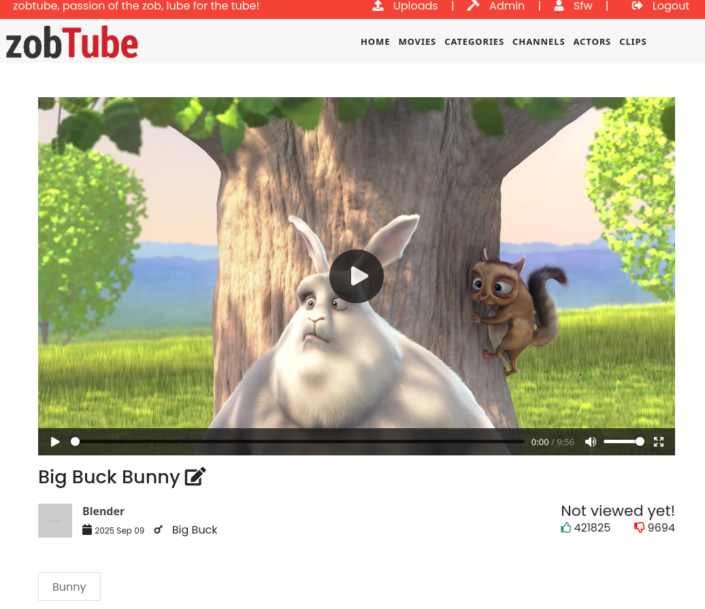

# ZobTube

_ZobTube, passion of the Zob, lube for the Tube!_


[](https://goreportcard.com/report/github.com/zobtube/zobtube)
[](https://raw.githack.com/wiki/zobtube/zobtube/coverage.html)

ZobTube is a library viewer and management tools for all your ~~porn~~ scientific videos.



To view more screenshots :camera:, see the [docs/screenshots.md](docs/screenshots.md) file.

## :information_source: Current status

:tada: Finally, all features, enhancements and bug fixed expected for 1.0.0 are released.
ZobTube will now enter a testing / QA phase to ensure acceptable quality for the 1.0.0 release.

All future developments will be followed on the [Kanban project view](https://github.com/orgs/zobtube/projects/1).

## :cop: About piracy

Piracy is bad. The FBI will not blow up your door for some downloaded porn. Yet, please respect the hard work of the actors by paying for their content.

> [!CAUTION]
> This goes without saying but **neither store illegal content nor content you don't own**.

## :wave: Everyone welcomed

As healthy sex life goes in pair of welcoming everyone, ZobTube endorses **LGBTQIA+** community.

For now, the only reference to some sexual identity is through the definition of actors. Only `male`, `female` and `trans women` are supported for now. But if anything's missing, feel free to create a pull request or a feature request.

## :vertical_traffic_light: Getting started

ZobTube works as a single binary. It needs a database to work but can rely on a local sqlite database. Parameters to start the binary can either be passed as a configration file or as environmental variables, as described below.

### Docker quickstart

Docker and Docker Compose guide is available under [docs/docker.md](docs/docker.md).

### Binary quickstart

Just start the binary without any parameter

```sh
./zobtube
```

If no configuration is provided, a default one will be created.
Then, ZobTube will be reachable on [http://127.0.0.1:8069](http://127.0.0.1:8069).

### Configuration file example

In `config.yml`, in the same folder as where ZobTube is started.

```yaml
server:
    bind: "127.0.0.1:8069"
db:
  driver: "sqlite"
  connstring: "zt.db"
media:
  path: "my_library_folder"
```

### Environmental variables example

```sh
ZT_SERVER_BIND="0.0.0.0:8069"
ZT_MEDIA_PATH="/mnt/zobtube"
ZT_DB_DRIVER="postgresql"
ZT_DB_CONNSTRING="host=pg user=zt password=topsecret dbname=zobtube port=5432 sslmode=disable"
```

### Configuration reference

Environmental variable name | Configuration variable name | Example values | Description
-|-|-|-
`ZT_SERVER_BIND` | `bind` | `127.0.0.1:8069` - `0.0.0.0:8069` | IP and port to lisen to.
`ZT_DB_DRIVER` | `db.driver` | `postgresql` - `sqlite` | Driver used for the database
`ZT_DB_CONNSTRING` | `db.connstring` | `zt.db` - `host=pg user=zt password=topsecret dbname=zobtube port=5432 sslmode=disable` | Connection string to pass to the database driver
`ZT_MEDIA_PATH` | `media.path` | `/mnt/zobtube` - `./my_library` - `C:\Users\zt\videos` | Library base path, where all content will be stored.

## :bar_chart: Alternatives

### Stash

The [Stash](https://github.com/stashapp/stash) project is a very similar project.
To be honest, it is way more advanced than ZobTube.
It has more features, more commits, more contributors, more Github stars.

ZobTube is aiming to include progressively those features.

Also, here is a short list of what ZobTube provides which is absent from Stash:

- A dedicated interface for short videos (a TikTok-like view, see the [screenshots page](docs/screenshots.md#short-video-viewer-tiktok-like))
- More third-party to retrieve information from about actors (like Pornhub, Boobpedia, Babepedia and Babes Directory)
- PostgreSQL support (but Stash support is [on its way](https://github.com/stashapp/stash/issues/3892))

### Whisparr

The [Whisparr](https://github.com/Whisparr/Whisparr) project is more oriented towards downloading and organizing content.

ZobTube, on the other hand, is more around organizing and viewing.

## :page_facing_up: License

ZobTube © 2025 by sblablaha is licensed under the MIT license.
