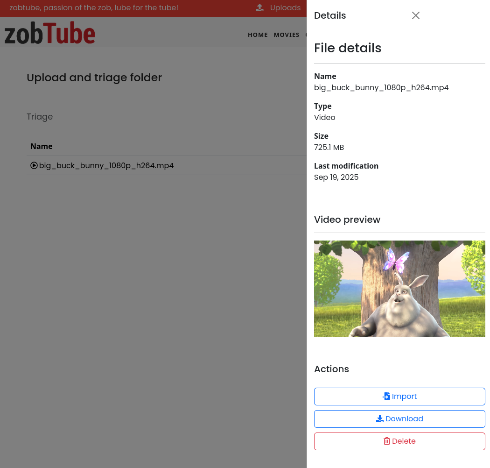

# :camera: Screenshots

Here is several screenshots of a safe-for-work instance, with the [Big Buck Bunny](https://peach.blender.org/about/) video as example.

## Home page

## Video viewer

## Short video viewer (TikTok-like)

## Video editor

## Actor editor

## Categories

## Video upload

## Video import

